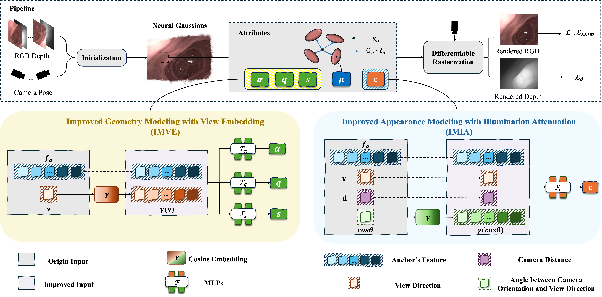

# ColIAGS

ICME 2026 论文官方代码（camera-ready 信息待更新）。  
Official implementation of our **ICME 2026** paper (camera-ready info will be updated).

本仓库提供一个面向内镜/结肠镜场景的 **深度监督**、**scaffold/anchor-based 3D Gaussian Splatting** 训练框架，包含数据读取、训练、渲染与评估（PSNR / SSIM / LPIPS / Depth MSE）。

<p align="center">
  
</p>

---

## Quick Start

```bash
# 1) 环境
conda create -n ColIAGS python=3.9 -y
conda activate ColIAGS

# 2) 安装依赖（或直接参考下方“环境配置”完整步骤）

# 3) 训练（以 C3VD 为例）
python train.py \
  -s data/C3VD/undistorted_downsize_270x338/<scene_name> \
  -m output/exp/<scene_name> \
  --eval \
  --port 6009
```

---

## 1. 环境配置 (Environment Setup)

### 1.1 运行环境 (Requirements)

- OS: Linux (recommended)
- GPU: NVIDIA GPU with CUDA support
- Python: `3.9` (tested)

### 1.2 安装 (Installation)

我们提供了一个安装脚本（更推荐用 `source` 执行，以确保 `conda activate` 生效）：

```bash
source create_env.sh
```

如果你的 shell 没有初始化 conda，可以先执行：

```bash
source $(conda info --base)/etc/profile.d/conda.sh
```

或手动逐行安装（与 `create_env.sh` 等价）：

```bash
conda create -n ColIAGS python=3.9 -y
conda activate ColIAGS

# PyTorch (CUDA 11.7)
pip install torch==1.13.1+cu117 torchvision==0.14.1+cu117 torchaudio==0.13.1 \
  --extra-index-url https://download.pytorch.org/whl/cu117

# Common deps
pip install opencv-python einops tqdm plyfile scipy natsort OpenEXR
pip install numpy==1.26.4

# Required (may need a matching wheel for your torch/cuda)
pip install torch_scatter

# CUDA extensions (build from source)
pip install submodules/simple-knn/ --no-build-isolation
pip install submodules/diff-gaussian-rasterization --no-build-isolation
```

Notes:
- If you cloned this repo with submodules, run:
  ```bash
  git submodule update --init --recursive
  ```
- If `torch_scatter` fails to install, please follow the official instructions of `torch-scatter` to install the correct wheel for your PyTorch/CUDA version.

---

## 2. 数据组织 (Data Organization)

The `data/` directory is ignored by git (see `.gitignore`). Please download/prepare datasets locally and place them under `data/`.

目前代码内置支持 **三种** 数据组织方式（会根据 `-s/--source_path` 路径字符串以及目录下的关键文件自动识别）：

### 2.1 C3VD（标准格式）

Expected structure for each scene:

```text
data/C3VD/undistorted_downsize_270x338/<scene_name>/
  camera_pose.txt
  camera.json
  images/
    0_color.png
    1_color.png
    ...
  depths/
    0_depth.png
    1_depth.png
    ...
```

Key files:
- `camera_pose.txt`: comma-separated 4x4 camera-to-world matrices (one per frame).
- `camera.json`: camera intrinsics, must include: `fx, fy, cx, cy, h, w`.
- Image/depth naming: current loader **expects** `"{idx}_*.png"` (e.g., `0_color.png`, `0_depth.png`) and will check the index consistency.

### 2.2 C3VD（pr-endo）+ EndoGSLAM 初始化（可选）

This loader is triggered when your `source_path` contains both `C3VD` and `pr-endo`.

Scene folder:

```text
data/C3VD/pr-endo/C3VD/<scene_name>/
  color/
    *.png
  depth/
    *.tiff
```

In addition, it expects an **optimized pose & point cloud** folder at:

```text
data/C3VD/pr-endo/C3VD_endogslam_optimized/<scene_name>/
  params.npz
  point_cloud/
    iteration_*/
      point_cloud.ply
```

### 2.3 ColonRotate（合成旋转序列）

Expected structure:

```text
data/ColonRotate/
  transforms.json
  transforms_test.json
  train_views/
    0000.png
    0001.png
    ...
  depth_train/
    0000.exr
    0001.exr
    ...
  test_views_1/
    0000.png
    0001.png
    ...
  init_point_cloud.ply
```

---

## 3. 训练 (Training)

### 3.1 训练单个场景

```bash
# Example: C3VD standard scene
python train.py \
  -s data/C3VD/undistorted_downsize_270x338/<scene_name> \
  -m output/exp/<scene_name> \
  --eval \
  --port 6009
```

- `-s/--source_path`: dataset scene path
- `-m/--model_path`: output directory
- `--eval`: enable evaluation split (for C3VD standard)
- `--port`: viewer port (disable with `--disable_viewer`)

### 3.2 使用脚本批量训练

See `script/train_again.sh` and `script/train_new.sh` for examples.

```bash
bash script/train_again.sh
# or
bash script/train_new.sh
```

---

## 4. 输出与评估 (Outputs & Evaluation)

Training will automatically:
1) save the Gaussian model
2) render train/test views
3) compute metrics

Typical outputs under `-m <model_path>`:

```text
<model_path>/
  point_cloud/
    iteration_30000/
      point_cloud.ply
  train/ours_30000/
    renders/  gt/  depth/  gt_depth/  errors/
  test/ours_30000/
    renders/  gt/  depth/  gt_depth/  errors/
  results.json
  per_view.json
```

Metrics:
- RGB: PSNR / SSIM / LPIPS
- Depth: MSE (between rendered depth and GT depth)

---

## 5. 致谢 (Acknowledgements)

This codebase is built upon and/or inspired by the following projects (thanks for the great open-source contributions):

- **3D Gaussian Splatting** (Graphdeco-Inria) and its CUDA rasterizer / KNN modules
- **GaussianShader** (some utility code references)
- **LPIPS** (perceptual metric)
- **FLIP** (NVIDIA; included in `flip/`)

Please also check the corresponding licenses of these projects.

---

## 6. 引用 (Citation)

If you find this repository useful, please cite our ICME 2026 paper.

> The BibTeX entry will be updated after the camera-ready/version is finalized.

```bibtex
@inproceedings{coliags_icme2026,
  title     = {<Paper Title>},
  author    = {<Authors>},
  booktitle = {Proceedings of the IEEE International Conference on Multimedia \& Expo (ICME)},
  year      = {2026}
}
```
