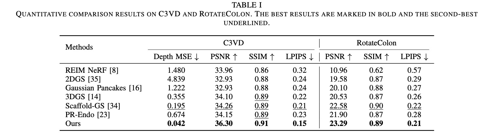
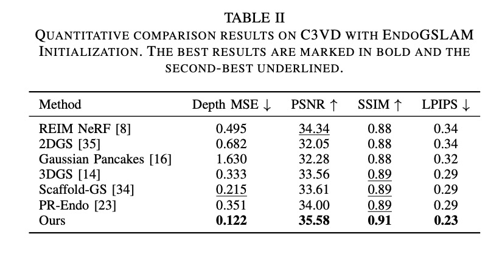
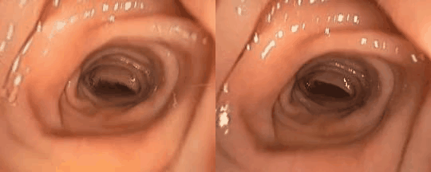
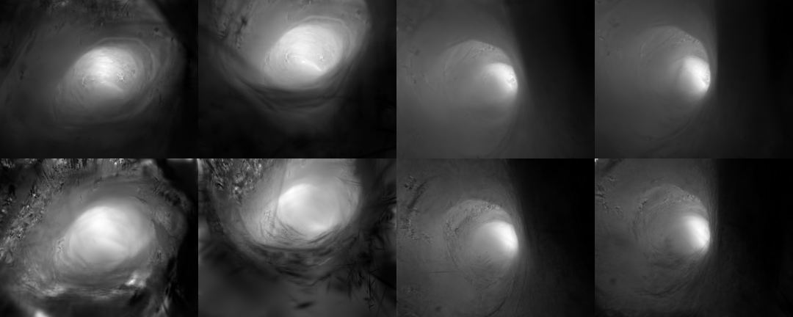

<h1>Moving Light Adaptive Colonoscopy Reconstruction via Illumination-Attenuation-Aware 3D Gaussian Splatting </h1>

## Overview

To address the challenge of dynamic illumination in 3D Gaussian Splatting (3DGS) for colonoscopy, where moving light sources degrade reconstruction quality, this work implements ***an Illumination-Attenuation-Aware 3D Gaussian Splatting method (ColIAGS)***. 

Specifically, ColIAGS consists of two key modules, i.e., Improved Geometry Modeling with View Embedding (IMVE) and Improved Appearance Modeling with Illumination Attenuation (IMIA).
IMVE enhances geometric representation by introducing high-frequency details, thereby improving the accuracy of appearance modeling.
IMIA incorporates both the camera (or light source) distance and orientation to accurately model the two types of illumination attenuation observed in colonoscopy while implicitly optimizing the illumination attenuation solutions through an MLP.

      

## Experimental Results

### 📊 Evaluation on C3VD and RotateColon

      

### 📊 Evaluation on C3VD without ground truth initialization

      

### 📷 Visualization Comparisons

      

### 👨‍⚕️ Validation on Clinical Data
To further evaluate the 3D reconstruction performance in clinical applications, we provide more results on a real-world benchmark called [**Colon10k**](https://ieeexplore.ieee.org/abstract/document/9433780). We compare both the rendering fidelity and geometric accuracy with another clinically-oriented method, [Gaussian Pancakes](https://github.com/smbonilla/GaussianPancakes).

As the initialization(RNNSLAM) used in Gaussian Pancakes is not accessible, we use the following strategy instead:

First, we generate temporal-consistent pseudo depth maps via [Video-Depth-Anything](https://github.com/DepthAnything/Video-Depth-Anything) and run [OneSLAM](https://github.com/arcadelab/OneSLAM) with the depth to generate the pose and point cloud that match the depth scale. With the prepared pose and point cloud, we follow the paradigm in Gaussian Pancake and initialize the Gaussians for both GS methods.

    <figure>
        
        <figcaption>Our PSNR=25.36（left）  Gaussian Pancake PSNR=24.15(right)</figcaption>
    </figure>

    <figure>
        
        <figcaption>Our Depth MSE=0.23（top）  Gaussian Pancake Depth MSE=1.14(down)</figcaption>
    </figure>

Qualitative comparisons show that the novel views rendered by Gaussian Pancakes exhibit some blurry artifacts, whereas our method achieves higher rendering fidelity. Additionally, the depth maps reconstructed by our approach are smoother and contain less noise.

## Implementations

Code will be made available after the paper is accepted.

## Acknowledgement
Thanks the authors for their works:

[3DGS](https://github.com/graphdeco-inria/gaussian-splatting)

[EndoGaussian](https://github.com/CUHK-AIM-Group/EndoGaussian)

[Scaffold-GS](https://github.com/city-super/Scaffold-GS)

[OneSLAM](https://github.com/arcadelab/OneSLAM)

[Video-Depth-Anything](https://github.com/DepthAnything/Video-Depth-Anything)
